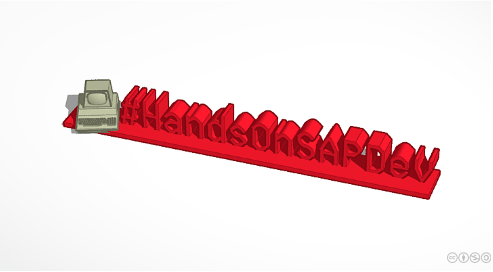
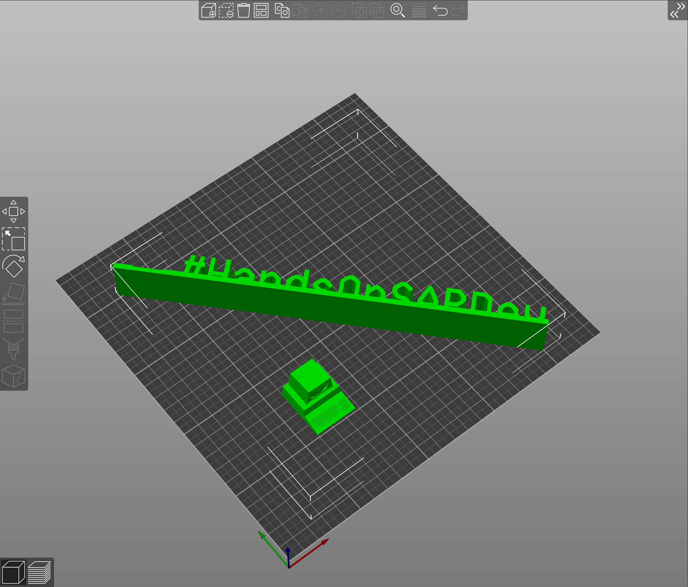
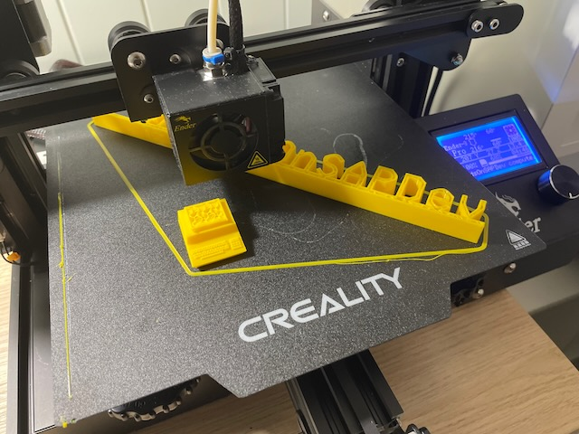

# 3D print v.1

Desk decoration, displaying the #HandsOnSAPDev hashtag. Original source is available on [TinkerCad](https://www.tinkercad.com/things/eg062ymN0vL), under the licence  [CC BY-NC-SA 3.0](https://creativecommons.org/licenses/by-nc-sa/3.0/). If you print it, or create something based on this, [DJ Adams](https://twitter.com/qmacro) and [I](https://twitter.com/rsletta) would be really happy if you shared it with us and the community on Twitter. 😀

Original print was sliced in [SuperSlicer](https://github.com/supermerill/SuperSlicer) and printed on a Creality Ender 3 Pro, using add:north e-PLA. I had to shrink the computer a tiny tiny amount, to make it fit better, but your mileage may vary.

Text is recommended to print on its back, and the model i prepared to be printed as two parts, that can be glued together.
The "computer fixed" model is modified from the original, by removing the hangover between computer and monitor, to remove print issues. 

