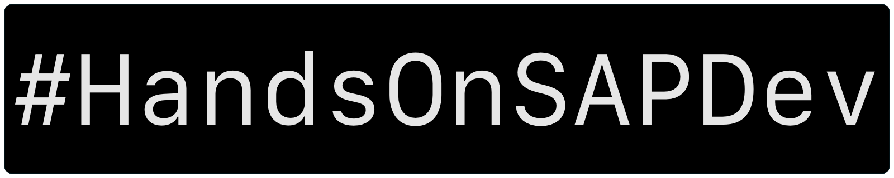
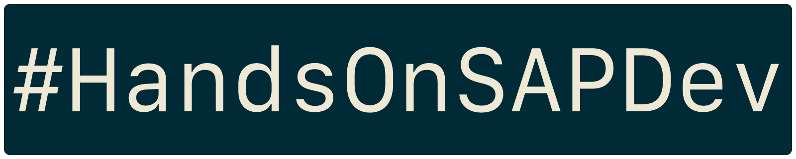

# Stickers v.1

First batch of stickers, created and released around SAP TechEd Barcelone 2019. The PNG files should be large enough for most sticker providers. Source files are provided in the original [Pixelmator](https://www.pixelmator.com/pro/) format, and exported to Photoshop PSDs. The PSD files are not checked, as I don't have access to Photoshop. Please let me know if they are screwed up.

The original stickers were produced by [Stickermule](https://www.stickermule.com), my preferred vendor of high quality stickers. If you are interested in ordering from them, you can use [this link](https://www.stickermule.com/unlock?ref_id=3036001701&utm_medium=link&utm_source=invite) to get a $10 store credit. __*Disclaimer: If you use this link and spend $10 or more, it will also give me a $10 store credit. If that happens, these credits will be funneled into future runs of #HandsOnSAPDev stickers and merch.*__

