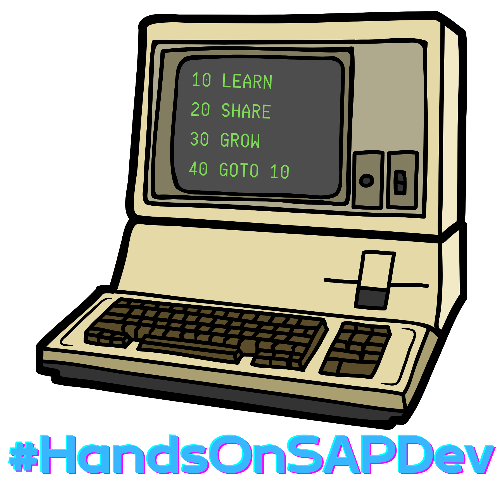

# Stickers v.2

Second batch of stickers, created and released on Friday 18. February 2022, on [this episode](https://www.youtube.com/user/sapdevs) of #HandsOnSAPDev.

The original stickers were produced as [holographic stickers](https://www.stickermule.com/products/holographic-stickers) by [Stickermule](https://www.stickermule.com), my preferred vendor of high quality stickers. If you are interested in ordering from them, you can use [this link](https://www.stickermule.com/unlock?ref_id=3036001701&utm_medium=link&utm_source=invite) to get a $10 store credit. __*Disclaimer: If you use this link and spend $10 or more, it will also give me a $10 store credit. If that happens, these credits will be funneled into future runs of #HandsOnSAPDev stickers and merch.*__

